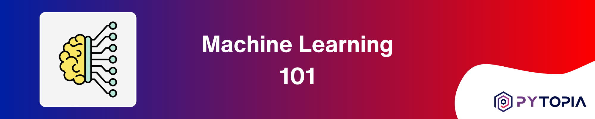
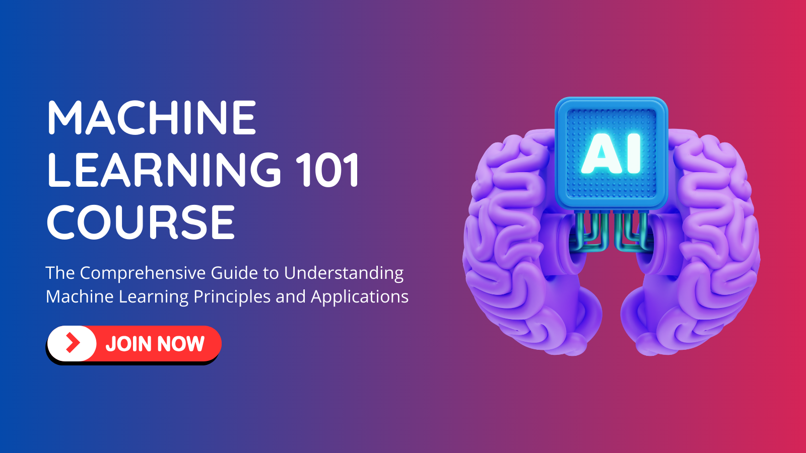

[](https://www.pytopia.ai)
[](https://t.me/pytopia_ai)
[](https://instagram.com/pytopia.ai)
[](https://www.youtube.com/@pytopia)
[](https://linkedin.com/company/pytopia)
[](https://twitter.com/pytopia_ai)

Welcome to the Machine Learning 101 course repository! This course is designed to provide a comprehensive overview of the fundamental concepts and techniques in Machine Learning. Whether you're a beginner looking to get started in this exciting field or an experienced practitioner seeking to refresh your knowledge, this course has something to offer.

## 🎯 Course Objectives

By the end of this course, you will:

- Understand the basic concepts and terminology of Machine Learning
- Gain familiarity with various types of Machine Learning algorithms
- Learn about popular Machine Learning tools and libraries
- Acquire hands-on experience in building a complete Machine Learning project
- Explore real-world applications and case studies of Machine Learning
- Discover the future trends and opportunities in the field of Machine Learning

## 📚 Course Contents

The course is divided into the following chapters:

1. Introduction to Machine Learning
2. Fundamentals of Machine Learning
3. Types of Machine Learning Algorithms
4. Machine Learning Tools and Libraries
5. Putting It All Together: Building a Machine Learning Project
6. Real-World Applications and Case Studies
7. The Future of Machine Learning

Each chapter includes a combination of theoretical explanations, practical examples, and hands-on exercises to reinforce your understanding of the concepts.

## ✅ Prerequisites

To get the most out of this course, you should have:

- Basic knowledge of mathematics (matrices)
- Enthusiasm to learn and explore the exciting world of Machine Learning!

# 📚 Learn with Us!
We also offer a [course on these contents](https://www.pytopia.ai/courses/machine-learning-101) where learners can interact with peers and instructors, ask questions, and participate in online coding sessions. By registering for the course, you also gain access to our dedicated Telegram group. Enroll now and start learning! Here are some useful links:

- [ML 101 Course](https://www.pytopia.ai/courses/machine-learning-101)
- [Pytopia Public Telegram Group](https://t.me/pytopia_ai)
- [Pytopia Website](https://www.pytopia.ai/)

[](https://www.pytopia.ai/courses/machine-learning-101)

#  🚀 Getting Started

To get started with the course, follow these steps:

1. Clone this repository to your local machine using the following command:
   ```
   git clone https://github.com/your-username/ml-101-course.git
   ```

2. Navigate to the cloned repository:
   ```
   cd ml-101-course
   ```

3. Start exploring the course materials, beginning with the first chapter.

Happy learning, and enjoy your journey into the fascinating world of Machine Learning!

# 📞 Contact Information

Feel free to reach out to us!

- 🌐 Website: [pytopia.ia](https://www.pytopia.ai)
- 💬 Telegram: [pytopia_ai](https://t.me/pytopia_ai)
- 🎥 YouTube: [pytopia](https://www.youtube.com/@pytopia)
- 📸 Instagram: [pytopia.ai](https://www.instagram.com/pytopia.ai)
- 🎓 LinkedIn: [pytopia](https://www.linkedin.com/in/pytopia)
- 🐦 Twitter: [pytopia_ai](https://twitter.com/pytopia_ai)
- 📧 Email: [pytopia.ai@gmail.com](mailto:pytopia.ai@gmail.com)
